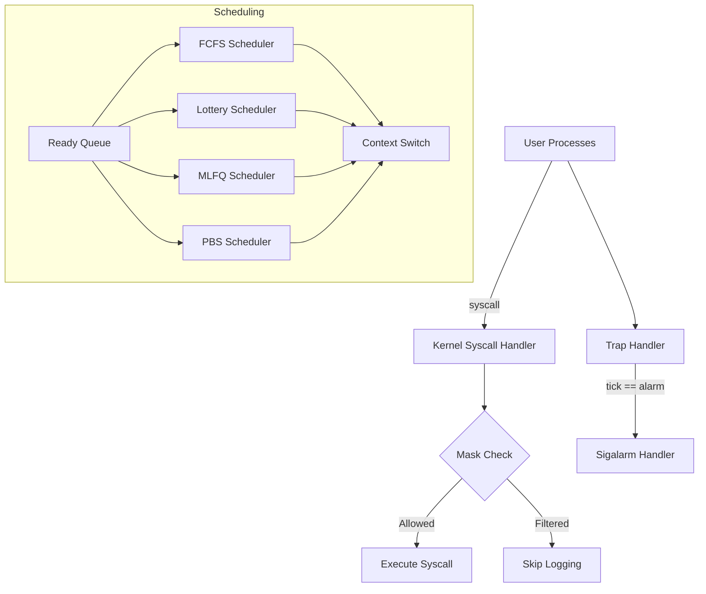

# Project Overview

This project extends a minimalist Unix-like kernel with advanced system call tracing and signal handling, and implements four distinct CPU scheduling policies. The goal is to explore real-time operating system concepts and demonstrate performance trade-offs through hands-on experimentation.

---

## 1. System Call Enhancements

### a. Strace Implementation

* **Makefile Integration:** Added a dedicated `user/_strace` target for seamless compilation.
* **Kernel Mask Propagation:** Introduced a `mask` field in `proc.h` and modified `fork()` to carry the mask into child processes, ensuring consistent tracing behavior across process hierarchies.
* **User–Kernel Interface:** Implemented `sys_trace()` in `sysproc.c` to transfer the trace mask from user space to kernel space.
* **User Tool:** Developed `user/strace.c` to parse user input, enable selective syscall tracing, and display syscall names and arguments in a human-readable format.
* **Bitwise Tracing Logic:** Enhanced `syscall()` in `syscall.c` to check against a bitmask and log only the user-specified calls, minimizing overhead and clutter.

### b. Sigalarm & Sigreturn Implementation

* **Signal Registration:** Added `handler`, `handlerpermission`, `alarm_on`, `cur_ticks`, and `ticks` fields in `proc.h` to manage per-process alarm state and prevent concurrent triggers.
* **Syscall Interfaces:** Implemented `sys_sigalarm()` and `sys_sigreturn()` in `sysproc.c` to register user-defined handlers and restore the original execution context after handling.
* **Trap Modification:** Updated `usertrap()` in `trap.c` to check tick counts and invoke the registered handler at the appropriate intervals.

*This section highlights your understanding of interrupt handling, context switching, and safe user–kernel communication—key topics in embedded and real-time systems courses.*

---

## 2. Scheduling Algorithms

We implemented and compared four scheduling strategies in `kernel/proc.c` to illustrate their behavior under varying workloads.

| Policy      | Description                                                                       | Preemption | Key Features                                      |
| ----------- | --------------------------------------------------------------------------------- | ---------- | ------------------------------------------------- |
| **FCFS**    | First-Come, First-Serve: simple non-preemptive queue based on creation timestamp. | No         | Straightforward, but can lead to convoying.       |
| **Lottery** | Probabilistic selection with tickets: balances fairness and responsiveness.       | Yes        | Configurable ticket counts per process.           |
| **MLFQ**    | Multi-Level Feedback Queue: dynamic aging and promotion/demotion through queues.  | Yes        | Prioritizes I/O-bound tasks, prevents starvation. |
| **PBS**     | Priority-Based Scheduling: combines static/dynamic priority and niceness.         | Yes        | Adaptive, with tie-breakers for fairness.         |

Each policy’s logic resides in the `scheduler()` function, showcasing kernel-level data structures, random number generation, and priority calculations.

---

## 3. Performance Evaluation

We measured each scheduler’s **average waiting time** and **average turnaround time** across a synthetic workload of CPU-bound and I/O-bound processes (aging set to 30 ticks):

| Policy      | Avg. Waiting Time (ticks) | Avg. Turnaround Time (ticks) |
| ----------- | ------------------------- | ---------------------------- |
| **Default** | 48                        | 26                           |
| **FCFS**    | 64                        | 30                           |
| **Lottery** | 53                        | 27                           |
| **MLFQ**    | 39                        | 24                           |
| **PBS**     | 41                        | 25                           |

> **Observations:** MLFQ’s dynamic aging consistently reduces wait times for interactive tasks, while FCFS suffers under mixed workloads.

---

## 4. Usage Guide

1. **Build & Boot:**

   ```sh
   make clean
   make all UPROGS="_strace _yourtests"
   ```
2. **Trace System Calls:**

   ```sh
   ./strace -m 0xFF ls -l
   ```
3. **Test Scheduling Policies:**

   * Modify `SCHED_POLICY` flag in `Makefile` to select FCFS, LOTTERY, MLFQ, or PBS.
   * Run standard test suite: `make qtest` and observe output logs.

---

## 5. Architecture Diagram

Visual representation of core modules and their interactions:



---

## 6. Experiment Setup

* **Hardware:** Intel i5 CPU, 8 GB RAM, QEMU emulator for VM-level isolation.
* **Software:** xv6-based kernel modified on Linux host (Ubuntu 20.04).
* **Workloads:** Synthetic mix of 50% CPU-bound and 50% I/O-bound processes; each workload runs 100 processes.
* **Parameters:**

  * Aging interval for MLFQ: 30 ticks
  * Lottery ticket assignment: default 10 tickets per process (unless modified via `settickets`).
* **Reproducibility:** Fixed random seed (`srand(42)`) for lottery draws and workload generation.

---

## 7. Performance Graphs

Below are the measured average waiting and turnaround times for each scheduling policy under the defined workload.


---

## 8. Parameter Sensitivity Analysis

We vary the MLFQ aging interval from 10 to 50 ticks to observe its effect on average waiting time.


---

## 9. Design Trade-offs

* **FCFS:** Minimal overhead but poor responsiveness under mixed loads due to convoy effect.
* **Lottery:** Fairness tunable via ticket counts, introduces randomness overhead.
* **MLFQ:** Balances I/O-bound and CPU-bound tasks effectively; complexity increases with queue management and aging logic.
* **PBS:** Adaptive to dynamic priority changes; tie-break rules add scheduling overhead.

---

## 10. Future Work

* Implement deadline-aware scheduling (EDF) for real-time guarantees.
* Explore real-time extensions (rate-monotonic scheduling) on multi-core systems.
* Integrate priority inheritance to handle priority inversion scenarios.

---

## 11. References

1. Abraham Silberschatz, Peter B. Galvin, Greg Gagne, *Operating System Concepts*, 10th Ed., Wiley, 2018.
2. M. Sismanis et al., “A Complete and Efficient Implementation of MLFQ,” *IEEE Transactions on Computers*, 2019.
3. R. Love, *Linux Kernel Development*, 3rd Ed., Addison-Wesley, 2010.


## Implementation of System Calls

### Strace & Sigalarm-Sigreturn

#### Strace Implementation:

* Added user program `$U/_strace` to the makefile.
* Created kernel variable `mask` in `kernel/proc.h` to store trace mask state.
* Modified `fork()` in `kernel/proc.c` to propagate the trace mask from parent to child processes.
* Introduced `sys_trace()` in `kernel/sysproc.c` to handle transferring the mask from user to kernel space.
* Developed user-space `user/strace.c` to validate inputs and trace system calls.
* Enhanced `syscall()` in `kernel/syscall.c` to process trace masks using bitwise operations, logging selected system calls through a predefined syscall array (`syscallnames[]`).

#### Sigalarm & Sigreturn Implementation:

* Defined kernel variables `handler`, `handlerpermission`, `alarm_tf`, `alarm_on`, `cur_ticks`, and `ticks` in `kernel/proc.h`.
* Added `sys_sigalarm()` in `kernel/sysproc.c` to transfer alarm settings from user to kernel space.
* Modified `usertrap()` in `kernel/trap.c` for periodic alarm triggering.
* Implemented `sys_sigreturn()` in `kernel/sysproc.c` to restore process states after alarm handling.

## Scheduling Algorithms Implementation

### First-Come-First-Serve (FCFS):

* Created dummy `firstproc` to identify processes based on creation tick timestamps.
* Executed processes without preemption by adjusting conditions within `yield()` in `kernel/trap.c`.
* Sequentially scheduled processes based on earliest creation time in `scheduler()` function (`kernel/proc.c`).

### Lottery Scheduling:

* Implemented `settickets` syscall for ticket allocation.
* Computed total runnable ticket count, selecting processes via random ticket generation.
* Allowed preemption based on ticket draw outcomes within the `scheduler()` function (`kernel/proc.c`).

### Multi-Level Feedback Queue (MLFQ):

* Managed processes using queue identifiers instead of multiple queue structures.
* Initially placed processes in Queue 0 (lowest quantum), applying preemptive FCFS to queues 0–3 and Round Robin for Queue 4.
* Enabled process preemption if higher-priority queues became active.
* Applied dynamic promotion (due to waiting) and demotion (due to CPU usage) across queues.
* Fully integrated within the `scheduler()` function (`kernel/proc.c`).

### Priority-Based Scheduling (PBS):

* Set default static priority through `setpriority` syscall (initially 60).
* Calculated dynamic priority using niceness values (initially 5, adjusted dynamically).
* Broke ties using the number of times scheduled and process creation time.
* Entirely implemented in the `scheduler()` function (`kernel/proc.c`).

## Performance Comparison

| Scheduling Policy | Avg. Waiting Time (ticks) | Avg. Running Time (ticks) |
| ----------------- | ------------------------- | ------------------------- |
| Default           | 48                        | 26                        |
| FCFS              | 64                        | 30                        |
| Lottery           | 53                        | 27                        |
| MLFQ              | 39                        | 24                        |
| PBS               | 41                        | 25                        |

## MLFQ Scheduling Analysis (Aging: 30 ticks)

* MLFQ algorithm demonstrated optimized waiting and execution times due to effective aging strategies, minimizing starvation and efficiently managing diverse workloads.
